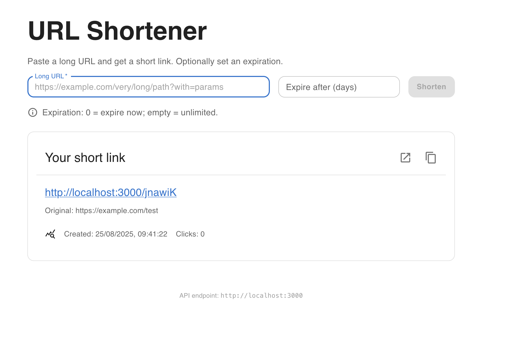

# 🔗 URL Shortener — Technical Test

[](https://nodejs.org/)
[](https://www.typescriptlang.org/)
[](https://react.dev/)
[](https://www.sqlite.org/)
[]()

🚀 Full-stack **URL Shortener** built as part of a **technical test**.  
Clean architecture, TypeScript everywhere, strong validation, security by default.

---

## ✨ Features
- 🔗 Shorten long URLs into random slugs (**idempotent**)
- ⏳ Expiration support (`0 = expire immediately`)
- 📊 Click counter + stats endpoint
- 🛡️ Security: helmet, rate-limiting, CORS
- ✅ Tests: Jest + ts-jest + Supertest
- 🎨 Frontend: React + Vite + Material UI + Zod



---

# URL Shortener — Full-stack Monorepo (Node 22.18, TypeScript, React, SQLite)

A secure and robust **URL shortener** project designed for local development and production readiness.

- **Frontend**: React + Vite + TypeScript + Material UI  
- **Backend**: Node.js + Express + TypeScript + SQLite (better-sqlite3)  
- **Quality**: Zod validation, Jest/ts-jest tests, SOLID principles, clean code, dependency injection

---

## 🚀 Quickstart

### Prerequisites
- Node.js **≥ 22.18** (recommended: install via `nvm`)
- npm (comes with Node.js)
- No need for Docker or Postgres: **SQLite** database is embedded

### 1) Install dependencies
```bash
git clone <your-repo> url-shortener
cd url-shortener
npm install
```

### 2) Environment variables

- **server/.env** (copy from `.env.example`)
  ```env
  PORT=3000
  FRONT_ORIGIN=http://localhost:5173
  DB_FILE=./data/url.db
  RATE_LIMIT_WINDOW_MIN=15
  RATE_LIMIT_MAX=100
  ```

- **client/.env** (optional)
  ```env
  VITE_API_BASE=http://localhost:3000
  ```

### 3) Start in development mode
```bash
npm start
```
- Frontend: http://localhost:5173  
- Backend API: http://localhost:3000

SQLite DB file is created automatically.

---

## 📦 Scripts (root)

- `npm start` : run server + client in parallel (dev mode)  
- `npm run build` : build backend (TS → JS) + frontend (Vite)  
- `npm run preview` : preview the built frontend  
- `npm test` : run backend tests  
- `npm run format` : format code with Prettier  
- `npm run setup` : install deps and start

---

## 🧭 Architecture

```
.
├─ client/                  # React + Vite + TS + MUI
│  └─ src/...
└─ server/                  # Node + Express + TS + SQLite
   └─ src/...
```

**Pattern**: `routes → services → repositories`  
- Routes: thin HTTP handlers  
- Services: business logic (validation, idempotency, collisions, expiration, counters)  
- Repositories: persistence (SQLite or InMemory for tests)  
- Dependency Injection: `createApp(repo)`

---

## 🔒 Security & robustness

- **Validation**: Zod schemas, strict types  
- **HTTP headers**: Helmet by default  
- **Rate limiting**: `express-rate-limit`  
- **CORS**: controlled by FRONT_ORIGIN  
- **Error handling**: central, no leaks  
- **Idempotency**: UNIQUE constraint on `original_url`  
- **Slug collisions**: handled with retries  
- **Expiration**: 0 = expire immediately (`410 Gone`)  

**Production vision**: Safe Browsing checks, CAPTCHA to mitigate abuse, CDN + WAF, structured logs, monitoring.

---

## 📡 API Endpoints

### POST /api/shorten
Request:
```json
{ "url": "https://example.com/path?x=1", "expiresInDays": 7 }
```
Response:
```json
{
  "original_url": "https://example.com/path?x=1",
  "short_url": "Ab12Cd",
  "short_link": "http://localhost:3000/Ab12Cd",
  "expires_at": "2025-08-20T12:34:56.000Z"
}
```

### GET /:slug
- **302 Redirect** → original_url  
- **410 Gone** if expired  
- **404 Not found** if unknown  

### GET /api/stats/:slug
```json
{
  "original_url": "https://example.com/path?x=1",
  "created_at": "2025-08-20T12:00:00.000Z",
  "hits": 42,
  "expires_at": null
}
```

---

## 🧪 Tests

Run:
```bash
npm test
```

- Jest + ts-jest + Supertest  
- Unit tests (UrlService): validation, idempotency, expiration, counter  
- Integration tests (API): shorten, redirect, stats  

---

## 🧠 Thought process

- **Express** for simplicity and ecosystem support  
- **SQLite** for fast setup; can migrate to Postgres in prod  
- **Dependency Injection**: easy testing & extensibility  
- **Zod**: strict validation and developer-friendly error messages  
- **nanoid v3 (CJS)**: pragmatic choice to avoid Jest ESM issues during a time-boxed test  

---

## ➕ Next steps

- Custom slugs, QR code generation  
- Authentication & dashboards  
- Production hardening: Redis cache, CDN, observability  
- Security: phishing/malware detection, reCAPTCHA, SCA tools  
- CI/CD: lint + tests + build pipeline  

---

## 🛠️ Troubleshooting

- **Port conflict**: change `PORT` (server) or `vite --port` (client)  
- **CORS issues**: update `FRONT_ORIGIN` in server/.env  
- **DB reset**: delete `data/url.db`  

---

Enjoy building ✨
